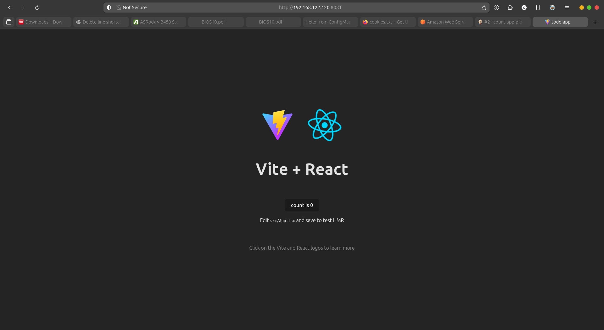

# TaskBlitz

**A simple application with a focus on CI/CD automation using Docker and Jenkins.**

## 🚀 Overview

TaskBlitz is a lightweight task management application designed to demonstrate the power of Continuous Integration and Continuous Deployment (CI/CD). This project showcases how to automate the build, test, and deployment processes using Docker and Jenkins.

## 🛠️ Technologies Used

* **Frontend**: TypeScript, JavaScript, CSS
* **Backend**: Node.js
* **Containerization**: Docker
* **CI/CD**: Jenkins
* **Version Control**: Git

## 🧪 Features

* **Dockerized Application**: The app is containerized using Docker, ensuring consistency across different environments.
* **Automated CI/CD Pipeline**: Jenkins automates the process of building, testing, and deploying the application.
* **Task Management**: Users can add, edit, and delete tasks.


## 📦 Getting Started

### Prerequisites

* Docker
* Jenkins
* Git

### Clone the Repository

```bash
git clone https://github.com/Suvratam/TaskBlitz.git
cd TaskBlitz
```

### Build and Run the Application

```bash
docker build -t taskblitz .
docker run -p 8080:80 taskblitz
```

Access the application at [http://localhost:8081](http://localhost:8081).

## 🔧 Jenkins Pipeline

The project includes a `Jenkinsfile` that defines the CI/CD pipeline:

* **Build**: Builds the Docker image.
* **Test**: Runs tests inside the container.
* **Deploy**: Deploys the application to a Docker container.

To use the Jenkins pipeline:

1. Set up a Jenkins job with the repository.
2. Configure Jenkins to use Docker.
3. Run the pipeline.

## 📄 Files

* `Dockerfile`: Defines the Docker image for the application.
* `Jenkinsfile`: Defines the CI/CD pipeline for Jenkins.
* `README.md`: This file.

## 📄 License

This project is licensed under the MIT License.

